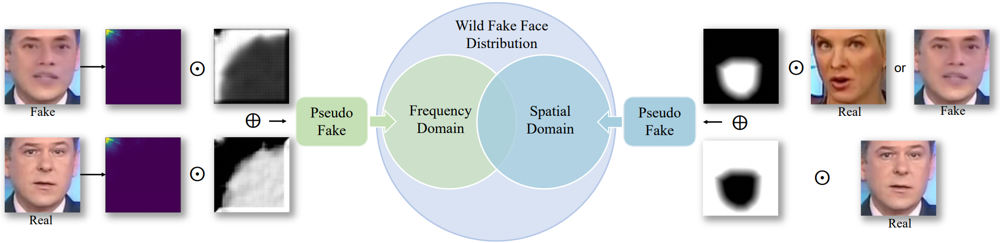

## FreqBlender: Enhancing DeepFake Detection by Blending Frequency Knowledge

**NeurIPS 2024 (Poster) **

This repository represents the official implementation of the paper titled "FreqBlender: Enhancing DeepFake Detection by Blending Frequency Knowledge".

[](https://arxiv.org/abs/2404.13872) [](https://creativecommons.org/licenses/by/4.0/) 

[Hanzhe Li](https://lihanzhe.github.io) , [Jiaran Zhou](https://jiaranzhou.github.io) , [Yuezun Li](https://yuezunli.github.io)<sup>#</sup>, [Baoyuan Wu](https://sites.google.com/site/baoyuanwu2015/), [Bin Li](http://ceie.szu.edu.cn/info/1017/1064.htm), [Junyu Dong](https://it.ouc.edu.cn/djy/main.htm) ,  [](https://yuezunli.github.io/ligroup/) [Vas Group](https://yuezunli.github.io/ligroup/)

<sup>#</sup>Corresponding author.




## 🛠️ Environment & Setup

The inference code was tested on:

Ubuntu 22.04 LTS, Python 3.9.17,  CUDA 12.2, GeForce RTX 3090ti


You can create a virtual environment and install the required dependency libraries in the following:

```python
pip install virtualenv
mkdir venv && cd venv
virtualenv FreqBlender
source FreqBlender/bin/activate
pip install -r requirement.txt
```


## 📦 Prepare for your dataset

1. Dataset.

   Download your datasets  [Celeb-DF-v2](https://github.com/yuezunli/celeb-deepfakeforensics), [FaceForensics++](https://github.com/ondyari/FaceForensics) and put them on a hard drive with plenty of memory.

2. Download landmark detector (shape_predictor_81_face_landmarks.dat) from [here](https://github.com/codeniko/shape_predictor_81_face_landmarks) and place it in `./dataPreprocess/` folder.  
3. Dataset preprocess.

   We can preprocess our data with the following:

   ```python
   python dataPreprocess/crop_dlib_ff.py -d Deepfakes -p "dataset_path"
   python dataPreprocess/crop_retina_ff.py -d Deepfakes -p "dataset_path"
   ```
   
4. Build a facebank for mobileface:

   Here we use the first frame of each real video in the FF++(c23) dataset as the face feature of this video.

   ```python
   python net/mobileface/facebank.py -p "dataset_path"
   ```

## ✏️ Visualization

 1. Dataset statistics.

    The statistics in the paper can be obtained by following the instructions below:

    **Notice:** Frequency visualization can only be done after the data preparation phase.

    ```python
    python dataAnalysis/calculate_dct.py -d "dataset_name" -p "dataset_path"
    ```

    then,  we will have the frequency statistics (Deepfake_real.npy) corresponding to the forgery mode.

 2. Statistical data visualization.

    The visualizations in the paper can be obtained by following the instructions below:
    
    ```python
    python dataAnalysis/freq_explore.py -d "dataset_name"
    ```

3. Training process visualization.

    ```python
    tensorboard --logdir=./logs
    ```


## 🏋️ Training

1.  Before you start training, you need to download our [resnet](https://pan.baidu.com/s/1wMX31nhz5V7JWnfdJtR_WQ?pwd=5tpd) weights and put them in the corresponding folder `(.FreqBlender/net/resnet/checkpoints)`. Or, you can choose to simply train a weight yourself into the corresponding folder. 

2. Before the final training, we also need to download the weights of the face prediction model and put it into the corresponding folder: 

   ```
   .
   └── net
       └── mobileface
           └── save_model
               ├── mtcnn
               │   └── ONet.pth
               │   └── PNet.pth
               │   └── RNet.pth
               └── mobilefacenet.pth
   ```

   

3. Finally, all you need to do is modify the corresponding configuration file in `./config`, and you can run `.main.py` directly.

4. Our weights can be downloaded [here(FPNet)](https://pan.baidu.com/s/1wMX31nhz5V7JWnfdJtR_WQ?pwd=5tpd).


## 🏃 Testing

1. You can download our model [weights(efn-b4)](https://pan.baidu.com/s/1wMX31nhz5V7JWnfdJtR_WQ?pwd=5tpd) and directly put them into the code for testing:

   ```python
   python inference/inference_dataset.py -w "model_weights" -d "dataset_name"
   ```

2. You can also create a folder to place your own weights for testing.

**Note: The model we are testing here is the model of the previous work that was trained using our method.**


3. If you want to train to get our weights, you need to replace the corresponding two files of [SBI](https://github.com/mapooon/SelfBlendedImages?tab=readme-ov-file) : 1) `.src/configs/sbi/base.json` needs to be replaced by [base.json](https://pan.baidu.com/s/1wMX31nhz5V7JWnfdJtR_WQ?pwd=5tpd), 2) `.src/utils/sbi.py` needs to be replaced by [sbi.py](https://pan.baidu.com/s/1wMX31nhz5V7JWnfdJtR_WQ?pwd=5tpd). Then, put our [weights(FPNet)](https://pan.baidu.com/s/1wMX31nhz5V7JWnfdJtR_WQ?pwd=5tpd) and code`(.net/aeNet/conv_autoencoder_pixelshuffle.py)` in folder`(.src/utils/aeNet)` of SBI.

## 🎓 Citation

Thanks for your attention, please cite our paper:

```bibtex
@article{li2024freqblender,
      title={FreqBlender: Enhancing DeepFake Detection by Blending Frequency Knowledge},
      author={Hanzhe Li and Jiaran Zhou and Yuezun Li and Baoyuan Wu and Bin Li and Junyu Dong},
      journal={Advances in Neural Information Processing Systems},
      year={2024}
}
```
